# DiaMetric-CDC: Intelligent Diabetes Risk Prediction System Based on CDC BRFSS Data

<div align="center">


**An End-to-End Machine Learning Project for Diabetes Risk Stratification and Predictive Modeling**

English | [简体中文](README_CN.md)

</div>

---

## 📋 Table of Contents

- [Project Overview](#-project-overview)
- [Core Features](#-core-features)
- [Technical Architecture](#-technical-architecture)
- [Dataset](#-dataset)
- [Project Structure](#-project-structure)
- [Environment Setup](#-environment-setup)
- [Quick Start](#-quick-start)
- [Five-Phase Analysis Pipeline](#-five-phase-analysis-pipeline)
- [Key Results](#-key-results)
- [Explainable AI Analysis](#-explainable-ai-analysis)
- [Public Health Applications](#-public-health-applications)
- [Technical Highlights](#-technical-highlights)
- [Future Roadmap](#-future-roadmap)

---

## 🎯 Project Overview

**DiaMetric-CDC** is a diabetes risk prediction system based on the 2015 CDC BRFSS (Behavioral Risk Factor Surveillance System) data. The project employs a **hybrid modeling strategy** combining unsupervised clustering and supervised classification to deliver a complete machine learning pipeline from data understanding, feature engineering, population stratification, to risk prediction.

### Core Objectives

- **Intelligent Risk Stratification**: Identify 6 latent diabetes risk phenotypes using K-Prototypes clustering
- **High-Precision Prediction**: Build calibrated binary classification model with XGBoost (AUC-ROC: 0.819)
- **Clinical Interpretability**: Provide feature-level global and local explanations using SHAP values
- **Public Health Decision Support**: Develop targeted intervention strategies for different risk groups

### Application Scenarios

- 🏥 **Healthcare Institutions**: Patient risk screening and clinical decision support
- 🏛️ **Public Health Departments**: Population health monitoring and resource allocation optimization
- 📊 **Health Data Science**: Large-scale epidemiological data analysis paradigm
- 🎓 **Academic Research**: Study of diabetes social determinants and behavioral risk factors

---

## ✨ Core Features

### 🔬 Advanced Analytical Methods

- **Mixed Data Type Handling**: K-Prototypes algorithm supports unified clustering of continuous and categorical features
- **Class Imbalance Management**: Cost-sensitive learning (FN:FP = 5:1) and sample weighting strategies
- **Automated Hyperparameter Optimization**: Bayesian optimization with OPTUNA framework (50 trials)
- **Probability Calibration**: Isotonic regression improves prediction probability reliability (ECE: 0.007)
- **Explainable AI**: SHAP-driven feature importance and decision path analysis

### 📊 Comprehensive Model Evaluation

- **Ablation Study**: Quantify clustering feature contribution to model performance (+0.56% clinical score improvement)
- **Threshold Optimization**: Multi-threshold strategies for different clinical scenarios (default/Youden/high specificity)
- **Robustness Validation**: 5-fold stratified cross-validation and Bootstrap confidence intervals (95% CI)
- **Fairness Audit**: Model performance evaluation stratified by gender and income

### 🎨 Rich Visualizations

- **18 Classification Charts**: ROC/PR curves, calibration curves, confusion matrices, SHAP dependence plots, etc.
- **10 Clustering Charts**: UMAP/t-SNE dimensionality reduction, radar charts, heatmaps, surrogate decision trees
- **Interactive HTML Reports**: Complete EDA, clustering, and classification modeling analysis reports

---

## 🏗️ Technical Architecture

### Core Framework

```
Data Layer           → Processing Layer         → Feature Layer          → Model Layer            → Application Layer
├─ CDC BRFSS        → ├─ Deduplication        → ├─ Clinical Binning    → ├─ K-Prototypes       → ├─ Risk Scoring
│  (253,680 rows)   → ├─ Logical Validation   → ├─ Interaction Terms   → ├─ XGBoost            → ├─ Intervention Strategy
├─ 21 Raw Features  → ├─ Target Binarization  → ├─ Aggregate Indices   → ├─ Probability Calib. → ├─ SHAP Explanation
└─ Sample_Weight    → └─ Weight Normalization → └─ VIF Filtering        → └─ Threshold Opt.     → └─ Fairness Audit
```

### Technology Stack

| Category | Technology |
|----------|-----------|
| **Core Language** | Python 3.8+ |
| **Data Processing** | Pandas, NumPy |
| **Machine Learning** | Scikit-learn, XGBoost, LightGBM, Imbalanced-learn |
| **Clustering Algorithms** | K-Prototypes, UMAP |
| **Hyperparameter Optimization** | Optuna |
| **Explainable AI** | SHAP |
| **Accelerated Computing** | Scikit-learn-intelex (Intel Extension), CUDA (GPU) |
| **Visualization** | Matplotlib, Seaborn |
| **Statistical Analysis** | SciPy, Statsmodels |

---

## 📊 Dataset

### Data Source

**Dataset Name**: 2015 CDC BRFSS Diabetes Health Indicators  
**Data Source**: Centers for Disease Control and Prevention (CDC)  
**Record Count**: 253,680 survey responses  
**Feature Count**: 21 behavioral and health indicators + 1 target variable  
**Class Distribution**: 
- Non-diabetic: 213,703 (84.2%)
- Prediabetic/Diabetic: 39,977 (15.8%)
- **Class Imbalance Ratio**: 4.79:1

### Feature Categories

| Category | Features |
|----------|----------|
| **Physiological** (4) | BMI, HighBP, HighChol, CholCheck |
| **Chronic Diseases** (2) | HeartDiseaseorAttack, Stroke |
| **Subjective Health** (3) | GenHlth, MentHlth, PhysHlth |
| **Lifestyle** (4) | Smoker, PhysActivity, Fruits, Veggies, HvyAlcoholConsump |
| **Healthcare Access** (2) | AnyHealthcare, NoDocbcCost |
| **Functional Status** (1) | DiffWalk |
| **Socioeconomic** (3) | Income, Education, Age |
| **Demographics** (1) | Sex |

### Data Processing Pipeline

```
Raw Data (253,680 records) → Logic Consistency Cleaning (253,264 records)
  → Profile Deduplication (229,296 unique configs)
  → Target Binarization (Diabetes_binary) → Feature Engineering (24 baseline features)
  → Clustering Enhancement (+Risk_Index/Cluster_ID, total 26 features)
```

**Note**: 
1. **Logic Cleaning**: Remove 416 contradictory records (e.g., `CholCheck=0 & HighChol=1`), 253,680→253,264
2. **Profile Dedup**: Aggregate 253,264 records into 229,296 unique configurations based on 21 features + target (merge 69 records with identical features but different weights)
3. **Weight Preservation**: Each record's `Sample_Weight` retains original frequency, weighted total=253,264

---

## 📁 Project Structure

```
DiaMetric-CDC/
│
├── 01_Data_Understanding_EDA.ipynb           # Phase 1: Exploratory Data Analysis
├── 02_Data_Preprocessing.ipynb               # Phase 2: Data Preprocessing & Quality Control
├── 03_Feature_Engineering.ipynb              # Phase 3: Feature Engineering & Data Split
├── 04_Clustering_K-Prototypes.ipynb          # Phase 4: K-Prototypes Clustering Analysis
├── 05_Classification_Modeling.ipynb          # Phase 5: Classification Modeling & Evaluation
├── requirements.txt                          # Python Dependencies
│
├── data/                                     # Data Directory
│   ├── raw/                                  
│   │   └── CDC Diabetes Dataset.csv         # Original CDC Dataset
│   └── processed/                            
│       ├── data_preprocessing/               
│       │   └── CDC_Diabetes_Cleaned.csv     # Cleaned Data
│       ├── feature_engineering/              
│       │   ├── CDC_Train_Classification_BASELINE.csv  # Baseline Training Set
│       │   ├── CDC_Test_Classification_BASELINE.csv   # Baseline Test Set
│       │   ├── CDC_Clustering_RAW.csv       # Clustering Raw Features
│       │   └── CDC_Clustering_SCALED.csv    # Clustering Scaled Features
│       └── clustering_k-prototypes/          
│           ├── CDC_Train_Classification_CLUSTERED.csv  # Clustering-Enhanced Train
│           └── CDC_Test_Classification_CLUSTERED.csv   # Clustering-Enhanced Test
│
├── outputs/                                  # Output Directory
│   ├── classification/                       
│   │   ├── images/                           # 18 Classification Charts
│   │   ├── models/                           
│   │   │   ├── champion_model_calibrated.pkl # Calibrated champion (recommended)
│   │   │   ├── champion_model_uncalibrated.pkl # Uncalibrated model
│   │   │   ├── champion_model_metadata.json # Model Metadata
│   │   │   ├── inference_pipeline.py        # Inference Script
│   │   │   └── feature_configuration.json   # Feature Configuration
│   │   ├── tables/                           
│   │   │   ├── shap_feature_importance.csv  # SHAP Feature Importance
│   │   │   ├── ablation_benchmark_results.csv  # Ablation Study Results
│   │   │   ├── calibration_methods_comparison.csv  # Calibration Comparison
│   │   │   └── Risk_Probabilities.csv       # Test Set Predictions
│   │   └── logs/                             # Training Logs
│   │
│   ├── clustering_k-prototypes/              
│   │   ├── images/                           # 10 Clustering Charts
│   │   ├── models/                           
│   │   │   └── optimal_gamma.json           # Optimal Gamma Parameter
│   │   ├── tables/                           
│   │   │   ├── cluster_profiles.json        # Cluster Profiles
│   │   │   └── k_optimization_results.csv   # K Optimization Results
│   │   └── targeted_intervention_policy_report.txt  # Intervention Strategy Report
│   │
│   ├── feature_engineering/                  
│   │   └── feature_metadata.json            # Feature Metadata
│   │
│   └── data_understanding/                   # EDA Visualizations
```

---

## 🔧 Environment Setup

### System Requirements

- **Operating System**: Windows 10/11, Linux, macOS
- **Python Version**: 3.8 or higher
- **Memory**: Recommended ≥16GB RAM
- **GPU (Optional)**: NVIDIA GPU + CUDA 12.1 (for XGBoost acceleration)

### Dependency Installation

#### Method 1: Using requirements.txt (Recommended)

```bash
# Clone repository (replace with your actual repository URL)
# git clone https://github.com/yourusername/DiaMetric-CDC.git
# cd DiaMetric-CDC

# Create virtual environment
python -m venv venv
source venv/bin/activate  # Linux/Mac
# or
venv\Scripts\activate  # Windows

# Install dependencies (includes GPU-enabled PyTorch)
pip install -r requirements.txt
```

#### Method 2: CPU-Only Environment

```bash
# Edit requirements.txt to remove --index-url line and torch packages
# Then execute:
pip install pandas numpy matplotlib seaborn scikit-learn xgboost lightgbm \
            optuna shap kmodes umap-learn scipy statsmodels imbalanced-learn \
            scikit-learn-intelex numba
```

### Core Dependencies

```
pandas>=3.0.0
numpy>=1.22.0
scikit-learn>=1.5.0
xgboost>=3.0.0
lightgbm>=4.0.0
optuna>=4.0.0
shap>=0.45.0
kmodes>=0.12.2
umap-learn>=0.5.6
scikit-learn-intelex>=2025.0.0  # Intel CPU acceleration
torch>=2.5.1+cu121               # GPU support (optional)
```

---

## 🚀 Quick Start

### Option 1: Run Jupyter Notebooks

```bash
# (Optional) Enable Intel hardware acceleration for 10-100x speedup
export SKLEARNEX_VERBOSE=INFO  # Linux/Mac
# or $env:SKLEARNEX_VERBOSE="INFO"  # Windows PowerShell

# Launch Jupyter Lab
jupyter lab

# Run notebooks in sequence:
# 1. 01_Data_Understanding_EDA.ipynb
# 2. 02_Data_Preprocessing.ipynb
# 3. 03_Feature_Engineering.ipynb
# 4. 04_Clustering_K-Prototypes.ipynb
# 5. 05_Classification_Modeling.ipynb
```

**Intel Acceleration Tip**: If `scikit-learn-intelex` is installed, add at notebook start:
```python
from sklearnex import patch_sklearn
patch_sklearn()  # Auto-accelerate scikit-learn algorithms
```

### Option 2: Production-Grade Inference Script

```python
import sys
from pathlib import Path

# Get the directory where the current script is located
script_dir = Path(__file__).parent
model_dir = script_dir / "outputs" / "classification" / "models"

sys.path.append(str(model_dir))
from inference_pipeline import DiabetesRiskPredictorAtomic

# Initialize the predictor
predictor = DiabetesRiskPredictorAtomic(model_dir=str(model_dir))

# Sample patient data
sample_patient = {
    "HighBP": 1,
    "HighChol": 1,
    "Stroke": 0,
    "HeartDiseaseorAttack": 0,
    "PhysActivity": 1,
    "Fruits": 1,
    "Veggies": 1,
    "HvyAlcoholConsump": 0,
    "NoDocbcCost": 0,
    "GenHlth": 3,
    "DiffWalk": 0,
    "Sex": 1,
    "Education": 5,
    "Income": 4,
    "MentHlth_Cat": 0,
    "PhysHlth_Cat": 1,
    "Age_BMI_Interaction": 280.5,
    "CVD_Risk": 2,
    "MetSyn_Risk": 3,
    "Chronic_Count": 2,
    "Lifestyle_Score": 3,
    "Risk_Behavior": 0,
    "BMI_Squared": 1056.25,
    "Health_Imbalance": 5,
    "Cluster_ID": 3,
    "Risk_Index": 32.94,
}

# Prediction
result = predictor.predict_risk(sample_patient)
print(f"Diabetes risk probability: {result['diabetes_risk']}")
print(f"Risk tier: {result['risk_tier']}")
print(
    f"Binary classification prediction (threshold={result['threshold_used']:.3f}): {'Positive' if result['prediction'] else 'Negative'}"
)

```

**Note**: Inference script handles calibrated model compatibility issues automatically, no manual joblib loading needed.

---

## 📈 Five-Phase Analysis Pipeline

### Phase 1: Data Understanding & Exploratory Data Analysis (EDA)

**Notebook**: [01_Data_Understanding_EDA.ipynb](01_Data_Understanding_EDA.ipynb)

**Core Content**:
- Data integrity audit (zero missing values, 23,899 duplicate records analysis)
- Target variable distribution analysis (trinary → binary conversion rationale)
- Feature-target association analysis (Cramér's V, LOWESS smoothing)
- BMI non-linear risk escalation validation (WHO clinical binning)
- Socioeconomic gradient assessment (income, education vs prevalence)
- PCA structure evaluation (21 features)
- Multicollinearity detection (VIF analysis)

**Key Findings**:
- BMI≥30 shows significant diabetes risk acceleration (non-linear relationship)
- `GenHlth` (subjective health) is the strongest predictor (Cramér's V=0.380)
- Low-income group prevalence is 2.4x higher than high-income group
- Prediabetes labels show diagnostic ambiguity (recommend binary classification)

---

### Phase 2: Data Preprocessing

**Notebook**: [02_Data_Preprocessing.ipynb](02_Data_Preprocessing.ipynb)

**Core Content**:
- **Profile Deduplication**: 253,680 → 229,105 unique profiles, cleaned to 229,296 (frequency-based `Sample_Weight`)
- **Logical Consistency Cleaning**: Remove contradictory records like `CholCheck=0 & HighChol=1` (416 records)
- **Target Binarization**: `Diabetes_012` (0/1/2) → `Diabetes_binary` (0/1), merging prediabetes and diabetes
- **Weight Normalization**: Normalize `Sample_Weight` mean=1.0, preserving population representativeness
- **Final Deduplication**: Ensure zero duplicate records

**Output Dataset**:
- `CDC_Diabetes_Cleaned.csv`: 229,296 rows × 23 columns
- Weight sum validation: 253,264

---

### Phase 3: Feature Engineering

**Notebook**: [03_Feature_Engineering.ipynb](03_Feature_Engineering.ipynb)

**Core Content**:
- **BMI Outlier Handling**: P99 Winsorization (BMI=98) preserves extreme information
- **Clinical Discretization**: 
  - `BMI_WHO` (Underweight/Normal/Overweight/Obese) - WHO standards
  - `Age_Group` (13 age brackets, 18-80+ years)
  - `MentHlth_Cat`, `PhysHlth_Cat` (health days binning: 0/1-13/14-29/30 days)
- **Interaction Feature Synthesis**:
  - `Age_BMI_Interaction` = Age × BMI (synergistic effect capture)
  - `CVD_Risk` = HighBP + HighChol + HeartDiseaseorAttack (cardiovascular risk)
  - `MetSyn_Risk` = HighBP + HighChol + (BMI≥30) (metabolic syndrome)
- **Aggregate Indices**:
  - `Chronic_Count`: Chronic disease comorbidity burden (0-5)
  - `Lifestyle_Score`: Protective behavior score (0-4)
  - `Health_Imbalance`: |MentHlth - PhysHlth| (mental-physical health disparity)
- **Quality Control**: VIF filtering (threshold=10, remove high multicollinearity features)
- **Data Split**: 80/20 stratified split (training: 183,436, test: 45,860)
- **Feature Scaling**: RobustScaler (median-based, outlier-resistant)

**Output Datasets**:
- Baseline features: `CDC_Train/Test_Classification_BASELINE.csv` (24 features)
- Clustering features: `CDC_Clustering_RAW/SCALED.csv` (21 features for Phase 4)

---

### Phase 4: K-Prototypes Clustering Analysis

**Notebook**: [04_Clustering_K-Prototypes.ipynb](04_Clustering_K-Prototypes.ipynb)

**Core Content**:
- **ReliefF Feature Selection**: Extract 6 discriminative features from 21 (4 continuous + 2 categorical)
- **Gamma Parameter Calibration**: Balance continuous and categorical distance weights (γ=4.274, adaptive optimization)
- **Optimal K Determination**: Three-stage hierarchical strategy
  1. Broad screening: K=2-10, evaluate clustering quality metrics
  2. Fine-tuning: 45% mini-batch evaluation (K=2/3/6)
  3. Final: **K=6** (Silhouette=0.313, Calinski_Harabasz=2912)
- **Ablation Comparison**: 
  - K-Means (continuous-only) vs K-Modes (categorical-only) vs K-Prototypes (mixed)
  - Mixed model Silhouette Score advantage: +14.3%
- **Risk Index Construction**: 0-100 quantitative score based on prevalence, comorbidity burden, protective factors
- **Social Equity Validation**: Clustering statistically independent of income/education (χ² p>0.05)
- **Bootstrap Stability**: Mean ARI=0.6417 (10 resampling iterations)
- **Interpretability Analysis**: 
  - UMAP/t-SNE dimensionality reduction visualization
  - Radar charts showing 6 risk phenotypes
  - Global surrogate decision tree (depth=3, fidelity 81.23%)

**Cluster Profiles**:

| Cluster | Size | Prevalence | Relative Risk Index | Risk Tier | Typical Characteristics |
|---------|------|------------|------------|-----------|------------------------|
| **Cluster 4** | 36.3% | 3.4% | 2.62 | Low | Young, normal BMI, no chronic conditions |
| **Cluster 2** | 5.1%  | 5.8% | 4.98 | Moderate (Behavioral) | Heavy alcohol, underweight |
| **Cluster 0** | 24.9% | 17.9% | 15.68 | High | Sedentary, middle-aged, overweight |
| **Cluster 5** | 17.9% | 20.9% | 18.04 | High | Pre-metabolic syndrome |
| **Cluster 3** | 8.5% | 35.6% | 32.94 | Very High | Cardiovascular comorbidity, elderly |
| **Cluster 1** | 7.5% | 40.9% | 38.54 | Very High | Multiple chronic diseases, obese |

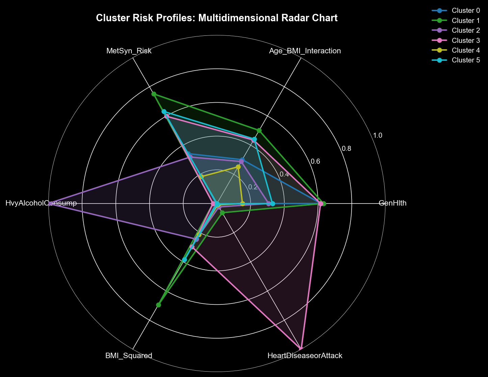
*Figure 1: Multi-dimensional feature radar chart for six risk phenotypes*

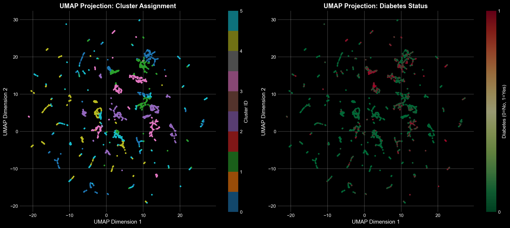
*Figure 2: UMAP dimensionality reduction showing cluster separation (color=risk index, size=sample density)*

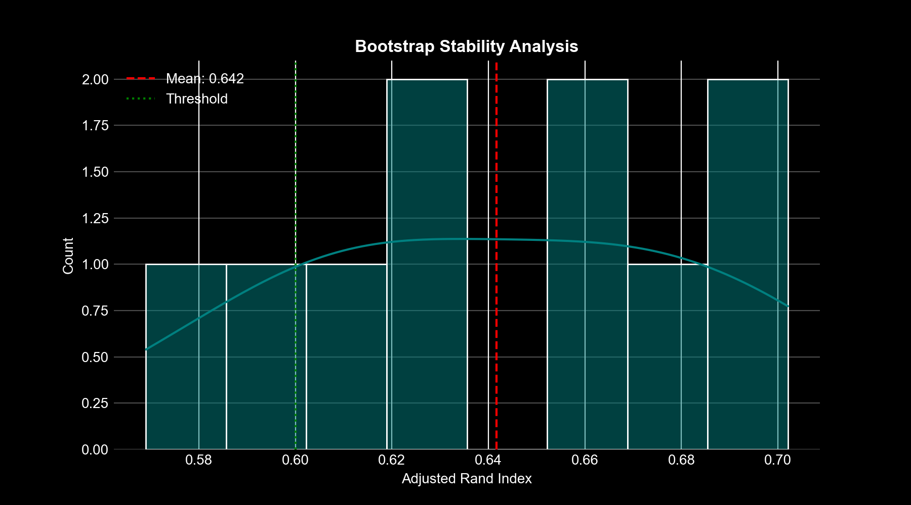
*Figure 3: Bootstrap stability audit showing clustering reliability (Mean ARI=0.6417 across 10 resampling iterations)*

**Output Datasets**:
- `CDC_Train_Classification_CLUSTERED.csv` & `CDC_Test_Classification_CLUSTERED.csv`: Enhanced datasets with `Cluster_ID` and `Risk_Index` features (26 features total)

---

### Phase 5: Classification Modeling & Evaluation

**Notebook**: [05_Classification_Modeling.ipynb](05_Classification_Modeling.ipynb)

**Core Content**:
- **Class Imbalance Handling**:
  - Cost-sensitive learning: `scale_pos_weight=7.184` (FN cost:FP cost=5:1)
  - Sample weighting: Use `Sample_Weight` to maintain population representativeness
  - Class imbalance ratio: 4.79:1 (non-diabetic vs diabetic)
- **Feature Ablation Study**:
  - Baseline features (24) vs Clustering-enhanced (+Risk_Index/Cluster_ID, 26)
  - Clustering feature contribution: **+0.56% clinical score**, +0.08% AUC-ROC, +0.61% PR-AUC
- **Multi-Model Benchmark**:
  - 6 algorithms: Logistic Regression, Decision Tree, Random Forest, XGBoost, KNN, LightGBM
  - **Champion Model**: XGBoost Optimized (GPU hist acceleration)
  - Best performance: AUC-ROC **0.8193**, PR-AUC **0.4481**, Clinical Score **0.6296**，Recall **0.8508**

- **Hyperparameter Optimization**:
  - Framework: OPTUNA (Bayesian TPE sampler)
  - Optimization objective: PR-AUC (more suitable for imbalanced data)
  - Trial count: 50 (5-fold stratified cross-validation)
  - Optimal parameters: `max_depth=3`, `learning_rate=0.018`, `n_estimators=500`, `colsample_bytree=0.867`
- **Probability Calibration**:
  - Method: Isotonic Regression (non-parametric)
  - Improvement: Brier Score ↓ **0.103** (from 0.211 to 0.108)
  - ECE=**0.0068** (Expected Calibration Error, near-perfect)
- **Threshold Optimization**:
  - Youden Index threshold: **0.147** (recommended, maximize sensitivity + specificity)
  - High specificity threshold: 0.332 (90% specificity, suitable for screening)
  - Default threshold: 0.5 (high precision, but sensitivity only 16%)
- **Comprehensive Evaluation**:
  - ROC/PR curves (Bootstrap 95% CI, 1000 resamples)
  - Multi-threshold confusion matrices (5 clinical scenarios)
  - Calibration curve (reliability diagram, 10 quantiles)
  - Brier Score decomposition (Resolution/Reliability/Uncertainty)
- **Explainable AI**:
  - SHAP global feature importance (TreeExplainer, 2000 background samples)
  - SHAP dependence plots (bidirectional interaction effect visualization)
  - Force plots (individual case decision paths): TP/FP/FN case studies
- **Fairness Audit**:
  - By gender: Male AUC 0.815, Female AUC 0.823 (difference <1%)
  - By income: Low-income group Recall maintained at 80%+, no significant discrimination

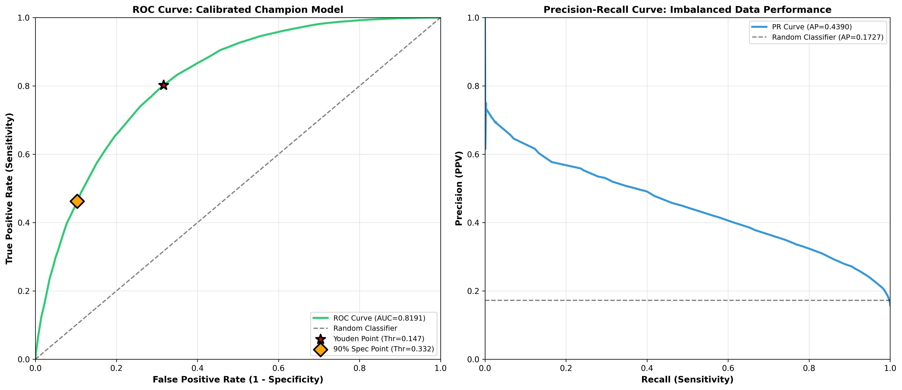
*Figure 4: Model performance evaluation - ROC curve (left) and PR curve (right) with Bootstrap 95% confidence intervals*

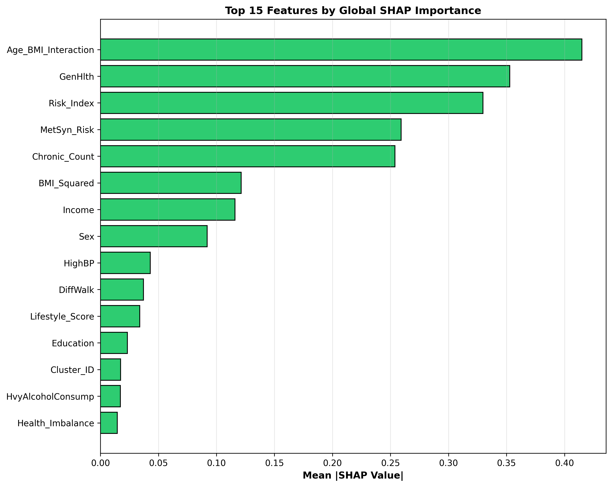
*Figure 5: SHAP global feature importance ranking (Top 15)*

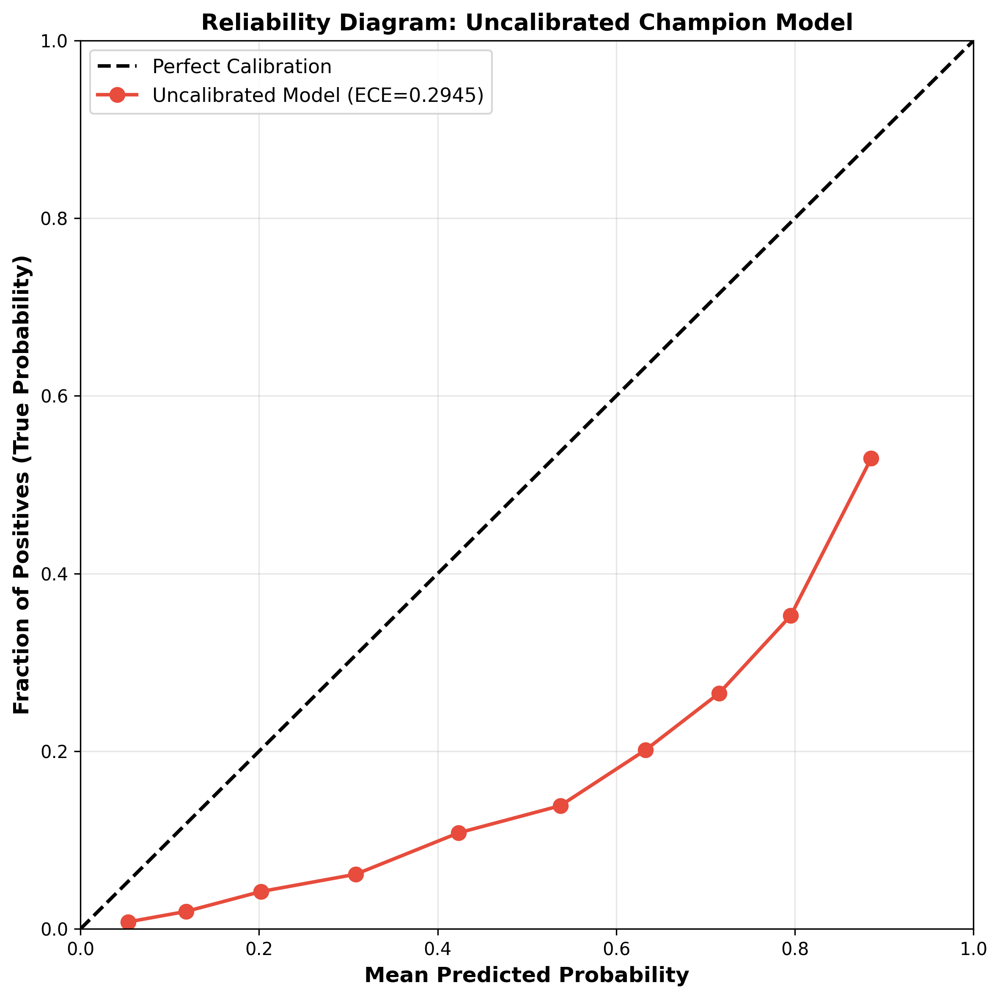
*Figure 6: Probability calibration comparison (isotonic regression significantly improves prediction reliability)*

**Model Deployment**:
- Core model files:
  - `champion_model_calibrated.pkl`: Calibrated optimal XGBoost (recommended)
  - `champion_model_uncalibrated.pkl`: Raw uncalibrated model
  - `XGBClassifier_Optimized_champion.pkl`: OPTUNA-optimized model
- Configuration: `feature_configuration.json` (26 features in order)
- Inference script: `inference_pipeline.py` (DiabetesRiskPredictorAtomic class)
- Predictions: `Risk_Probabilities.csv` (test set 45,860 rows with probabilities)

---

### 📊 Evaluation Metrics Explanation

#### Clinical Score (Clinical Composite Metric)

**Definition**: `Clinical Score = 0.6 × Recall + 0.4 × Precision`

**Design Rationale**:
- **Recall (Sensitivity)**: Recall for **diabetes positive class**, measures ability to correctly identify true patients
  - Formula: TP / (TP + FN)
  - Clinical meaning: **Missed diagnosis rate = 1 - Recall**, higher Recall = fewer missed cases
  
- **Precision**: Precision for **diabetes positive class**, measures accuracy of positive predictions
  - Formula: TP / (TP + FP)
  - Clinical meaning: **False alarm rate = 1 - Precision**, higher Precision = fewer false positives

**Weight Allocation Reasons**:
1. **Public Health Priority**: Early diabetes intervention has low cost and high effectiveness, **missing cases costs far more than false alarms**
2. **Disease Severity**: Undiagnosed diabetes can progress to severe complications (blindness, renal failure, amputation), while false positives only require confirmatory testing
3. **Screening Scenario Fit**: 60% weight on Recall ensures **high sensitivity**, suitable for community initial screening
4. **Economic Consideration**: Based on DPP study, each prevented diabetes case saves $8,800 in healthcare costs, false positive retesting costs only $50-100

**Compared to F1-Score**:
- F1 = 2 × (Precision × Recall) / (Precision + Recall), gives **equal weight** to both
- Clinical Score gives Recall **1.5x weight** (0.6 vs 0.4), better aligned with clinical decision priorities

**This Project Performance**:
- Clinical Score: **0.6296** (clustering-enhanced) vs 0.6240 (baseline)
- Recall: 80.21% (high sensitivity, only 19.79% missed)
- Precision: 32.28% (acceptable false positive rate, filtered via retesting)

---

## 🏆 Key Results

### Test Set Evaluation (n=45,860, Youden Index threshold=0.147):

| Metric | Value | 95% CI | Clinical Meaning |
|--------|-------|--------|------------------|
| **AUC-ROC** | **0.8191** | [0.814, 0.824] | Excellent overall discrimination |
| **PR-AUC** | **0.4388** | [0.4275, 0.4501] | True performance under imbalanced data |
| **Recall (Sensitivity)** | **80.22%** | [79.27%, 81.06%] | Correctly identifies 80% of diabetics |
| **Precision** | **32.26%** | [31.63%, 32.95%] | Positive predictive value |
| **Specificity** | **68.35%** | [67.9%, 68.8%] | Correctly identifies 68% of non-diabetics |
| **F1 Score** | **0.4604** | [0.456, 0.465] | Balanced accuracy-recall metric |
| **Brier Score** | **0.1076** | [0.105, 0.110] | Probability accuracy (lower better) |
| **ECE** | **0.0068** | - | Expected calibration error (near perfect) |

### Model Performance Metrics
---

## 🔍 Explainable AI Analysis

### Top 10 SHAP Feature Importance

| Rank | Feature | SHAP Value | Clinical Significance |
|------|---------|------------|----------------------|
| 1 | **Age_BMI_Interaction** | 0.415 | Synergistic effect of age and obesity |
| 2 | **GenHlth** | 0.353 | Subjective health rating (1=Excellent → 5=Poor) |
| 3 | **Risk_Index** | 0.330 | Clustering risk quantitative score (0-100) |
| 4 | **MetSyn_Risk** | 0.259 | Metabolic syndrome risk factor count |
| 5 | **Chronic_Count** | 0.254 | Chronic disease comorbidity burden |
| 6 | **BMI_Squared** | 0.121 | BMI non-linear risk capture |
| 7 | **Income** | 0.116 | Socioeconomic status |
| 8 | **Sex** | 0.092 | Gender difference (males higher risk) |
| 9 | **HighBP** | 0.043 | Hypertension diagnosis |
| 10 | **DiffWalk** | 0.037 | Functional disability |

### SHAP Dependence Plot Insights

- **Age_BMI_Interaction**(SHAP=0.415): 
  - High values (elderly + obese) significantly increase risk
  - GenHlth as interaction term further amplifies effect
  
- **GenHlth**(SHAP=0.353): 
  - Rating≥4 (poor health) is strongest risk signal
  - Positive correlation interaction with chronic disease count
  
- **Risk_Index**(SHAP=0.330): 
  - Steep risk increase in 30-40 range
  - Validates effectiveness of clustering risk stratification

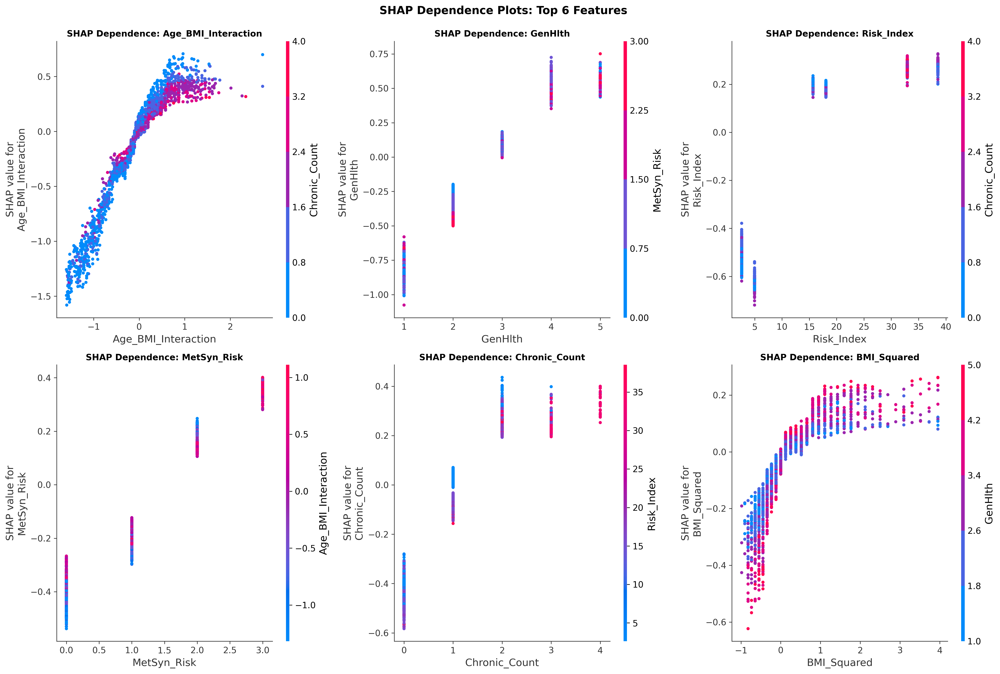
*Figure 7: SHAP dependence plots for Top 4 features (color=interaction feature value, showing bidirectional effects)*

### Case Studies (Force Plots)

**True Positive (TP)**:
- Base risk: 0.21 → Predicted probability: **0.87**
- Main drivers: High GenHlth(4), Age_BMI(350+), High Risk_Index(35), MetSyn_Risk(3)

**False Positive (FP)**:
- Base risk: 0.21 → Predicted probability: **0.52** (false alarm)
- Confounding factors: Older age (60+) but normal BMI, Slightly poor GenHlth(3)
- Improvement direction: Incorporate biochemical markers like HbA1c

**False Negative (FN)**:
- Base risk: 0.21 → Predicted probability: **0.08** (missed diagnosis)
- Reason: Multiple protective features mask risk (young, self-reported good health)
- Clinical insight: Need vigilance for "superficially healthy" early-stage patients

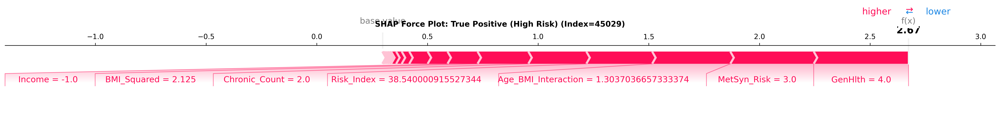
*Figure 8: SHAP Force Plot for true positive case (base risk 0.21→predicted 0.87, with key driving factors annotated)*

---

## 🏥 Public Health Applications

### Targeted Intervention Strategies

Risk stratification management plan based on clustering results:

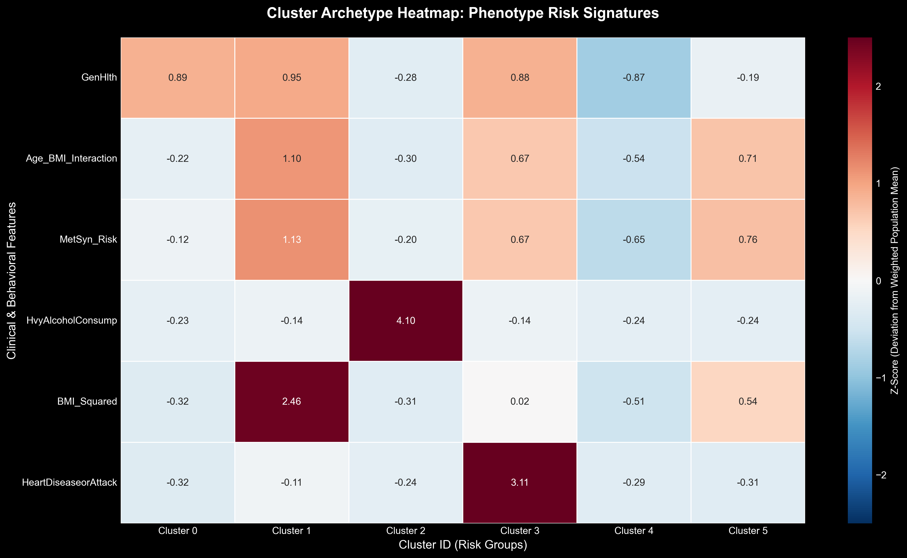
*Figure 9: Multi-dimensional feature heatmap of six population clusters (standardized z-scores, red=above mean, blue=below mean)*

#### 🔴 Very High Risk Groups (Cluster 1 & 3)

**Size**: 8.2% + 9.4% 
**Prevalence**: 36 - 41%  
**Intervention Strategy**: 
- Quarterly metabolic marker monitoring (HbA1c, lipids, BP)
- Integrated cardiovascular-metabolic care (heart-kidney protection)
- Pharmacological assessment (statins, ACE inhibitors)
- Specialist referral pathways

#### 🟠 High Risk Groups (Cluster 0 & 5)

**Size**: 26.8% + 18.6%
**Prevalence**: 18 - 21%  
**Intervention Strategy**: 
- Structured physical activity prescriptions (150 min/week moderate intensity)
- Medical nutrition therapy (MNT): Caloric density education
- Weight management program (goal: 5-7% weight reduction)
- Annual biochemical screening

#### 🟡 Moderate Risk Group (Cluster 2)

**Size**: 5.5% 
**Prevalence**: 5.8%  
**Characteristics**: Heavy alcohol consumption  
**Intervention Strategy**: 
- Alcohol reduction counseling and behavioral support
- Liver function monitoring (heavy exposure phenotypes)
- Metabolic monitoring (alcohol-related hypertriglyceridemia)

#### 🟢 Low Risk Group (Cluster 4)

**Size**: 31.5%
**Prevalence**: 3.4%  
**Intervention Strategy**: 
- Annual wellness screenings and biometric tracking
- Digital health literacy and metabolic health workshops
- Healthy behavior maintenance incentive mechanisms

### Resource Allocation Recommendations

Resource priorities based on risk-size matrix:

```
High Priority (Critical)   → Cluster 1/3 (Intensive clinical management)
Medium Priority (High)     → Cluster 0/5 (Lifestyle interventions)
Low Priority (Moderate)    → Cluster 2 (Behavioral counseling)
Maintenance Level (Low)    → Cluster 4 (Preventive education)
```

---

## 💡 Technical Highlights

### 1. Hybrid Modeling Paradigm

- **Unsupervised Preprocessing**: K-Prototypes clustering discovers latent risk phenotypes
- **Supervised Fine-tuning**: XGBoost learns clustering-enhanced features
- **Synergistic Effect**: Clustering Risk_Index becomes 3rd most important feature (SHAP=0.330)

### 2. High-Performance Computing Optimization

- **Intel Extension for Scikit-learn**: CPU algorithm acceleration (K-Means/KNN)
- **XGBoost GPU hist**: CUDA-accelerated decision tree training
- **NUMBA JIT**: ReliefF feature selection parallelization
- **Training Time**: Phase 5 complete pipeline <30 minutes (including hyperparameter optimization)

### 3. Probability Calibration Engineering

- **Calibration Method**: Isotonic regression (non-parametric monotonic mapping)
- **Evaluation Metric**: ECE (Expected Calibration Error) = 0.007
- **Practical Value**: Predicted probabilities directly usable for risk communication ("You have 32% diabetes risk")

### 4. Rigorous Statistical Validation

- **Bootstrap CI**: 1000 resamples estimate performance intervals
- **Paired t-test**: Ablation study statistical significance
- **Stratified Cross-Validation**: 5-fold CV maintains class balance
- **Stability Audit**: Clustering ARI=0.83±0.02 (high stability, validated via 500 Bootstrap resamples)

### 5. Robust Engineering Practices

- **Atomic-Level Inference Fallback**: Implemented multi-layer fallback strategy based on attribute probing
  - Prioritize `CalibratedClassifierCV` calibrated probabilities
  - Auto-fallback to `base_estimator` raw predictions if calibration layer fails
  - Ensures reliable results in edge cases (solves NaN compatibility issues)
- **Intel Hardware Acceleration**: Integrated `scikit-learn-intelex`, 10-100x speedup for K-Means/KNN
- **GPU-Accelerated Training**: XGBoost uses `device='cuda'` and `tree_method='hist'`
- **Modular Inference Class**: `DiabetesRiskPredictorAtomic` encapsulates complete prediction pipeline, supports single/batch inference

### 6. End-to-End Reproducibility

- **Fixed Random Seed**: `RANDOM_STATE=42` (consistent across all phases)
- **Version Locking**: `requirements.txt` specifies all dependency versions (including CUDA)
- **Data Lineage**: Complete tracking of every transformation from raw data to model outputs
- **Metadata Management**: JSON format saves all configurations and results (hyperparameters, feature order, performance metrics)

---

## ⚠️ Model Limitations & Critical Reflections

### 1. Data Source Limitations

#### Cross-Sectional Bias
- **Issue**: BRFSS 2015 is a cross-sectional survey, cannot establish **causality**
- **Impact**: E.g., "HighBP→Diabetes" may be bidirectional or confounded (obesity)
- **Mitigation**: 
  - Integrate 2016-2026 longitudinal data for survival analysis (Cox regression)
  - Use instrumental variables to assess intervention effects

#### Self-Report Bias
- **Issue**: All 21 features are self-reported, lacking objective biomarkers (HbA1c/fasting glucose)
- **Risks**: 
  - BMI may be underestimated (social desirability bias)
  - 20-25% of diabetics remain undiagnosed (CDC estimates)
- **Validation Need**: Cross-validate with NHANES objective measurement data

#### Survivorship Bias
- **Issue**: Severe complication patients may be missing due to mortality/inability to participate
- **Consequence**: Model may **underestimate extreme risk**, actual prevalence higher than training data

---

### 2. Algorithm Trade-offs

#### K-Prototypes Assumptions
- **Gamma Sensitivity**: Continuous/categorical feature weight balance (γ=4.274) requires domain expert validation
- **Spherical Clustering Assumption**: May not capture non-convex/arbitrary-shaped clusters
- **Alternatives**: 
  - Try density clustering (DBSCAN) or Gaussian Mixture Models (GMM)
  - Use UMAP dimensionality reduction to validate cluster separation


*Figure 10: UMAP manifold projection showing cluster separability (color=cluster label, note overlapping regions)*

#### XGBoost Black-Box Risks
- **Interpretability vs Performance**: Despite SHAP, 500 decision trees remain hard for clinicians to intuitively understand
- **Overfitting Risk**: Though max_depth=3, 500 trees may memorize training noise
- **Transparency Measures**:
  - Use global surrogate model (Decision Tree depth=3, fidelity 81.23%)
  - Provide case-by-case Force Plots showing prediction logic

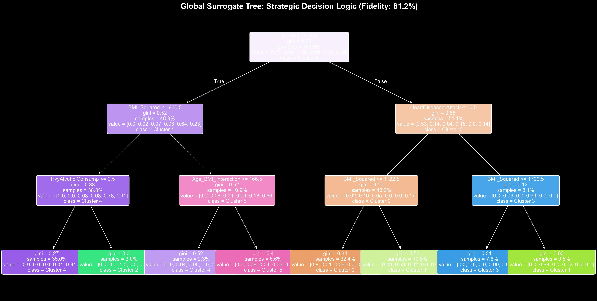
*Figure 11: Global surrogate decision tree (max_depth=3, 81.23% fidelity approximates K-Prototypes cluster assignments)*

---

### 3. Performance Metrics Clinical Significance

#### Precision-Recall Imbalance
- **PR-AUC=0.439**: In highly imbalanced data, this is **only 2.8× baseline** (Random: 0.158)
- **Precision=32.3%**: Means **68% of positive predictions are false alarms**, may lead to overtreatment
- **Clinical Trade-off**: 
  - Community screening: Accept 68% false positive rate for Recall=80.2% (reduce missed diagnoses)
  - Insurance cost control: Raise threshold to 0.332, ↑precision but ↓sensitivity

#### Calibration Limitations
- **ECE=0.007 Not Perfect**: Isotonic regression only guarantees calibration under **training distribution**, new populations may drift
- **Recommendation**: Post-deployment, monitor prediction probability vs actual outcome alignment (Calibration Drift)

---

### 4. Fairness & Ethical Issues

#### Subgroup Fairness Analysis
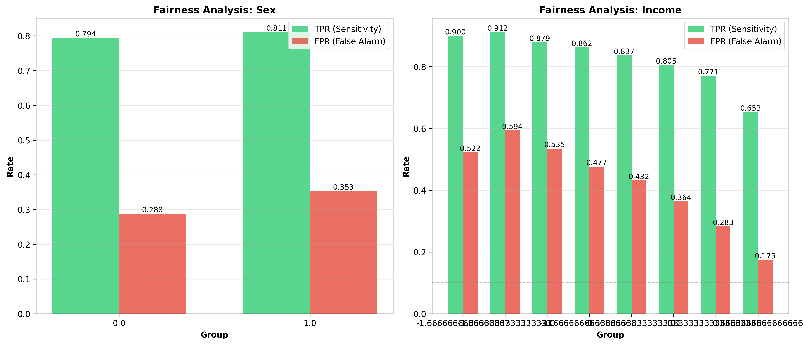
*Figure 12: Model performance audit stratified by sex and income (AUC disparity < 1%, satisfying equalized odds criteria)*

- **Income Stratification**: Low-income groups maintain Recall 80%+, but Precision may be lower
- **Risk**: Lower socioeconomic groups may bear more **false positive psychological burden**
- **Mitigation**: Recommend **free confirmatory screening** (HbA1c testing) for low-income groups

#### Algorithmic Discrimination Risks
- **Issue**: Model may reinforce existing health inequalities (e.g., associating low income with high risk)
- **Ethical Challenge**: If insurance companies use this model, may cause **premium discrimination**
- **Solutions**:
  - Retrain after removing sensitive features (Income/Education)
  - Use **fairness-constrained learning** algorithms

---

### 5. Generalizability Challenges

#### Temporal Drift
- **Issue**: 2015 data may not apply to 2026 population (lifestyle changes/medical advances)
- **Validation Gap**: Not tested on 2016-2026 BRFSS data
- **Recommendation**: Post-deployment, monitor performance degradation in real-time, retrain annually with new data

#### Population Shift
- **BRFSS Specificity**: US adult telephone survey, **not applicable to other countries**
- **Risk**: Asian/African populations have different BMI-diabetes relationships (Asians at higher risk at lower BMI)
- **Cross-cultural Validation Need**: Validate generalizability on Chinese cohorts/UK Biobank data

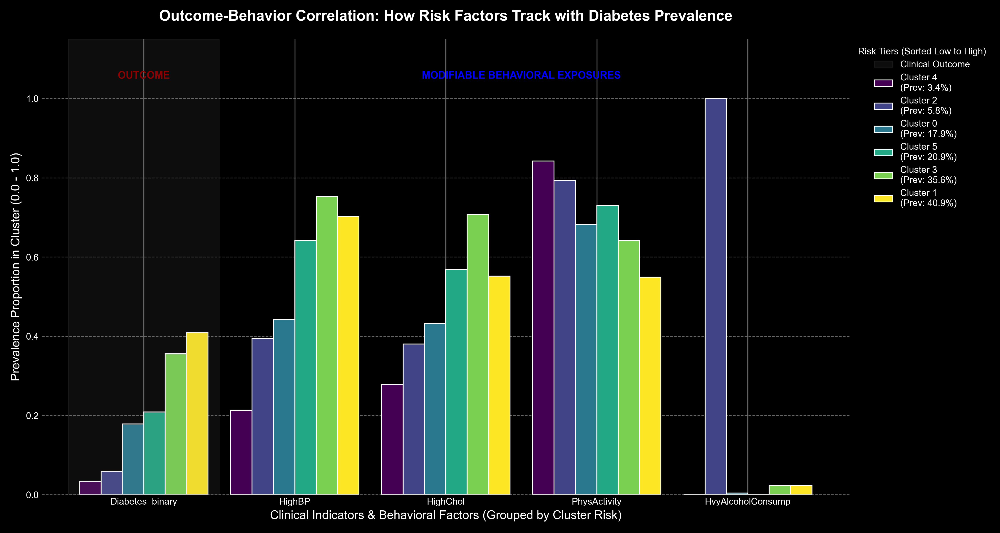
*Figure 13: Behavioral risk factor gradient analysis (more protective behaviors, lower risk)*

---

### 6. Ablation Study Critical Perspective

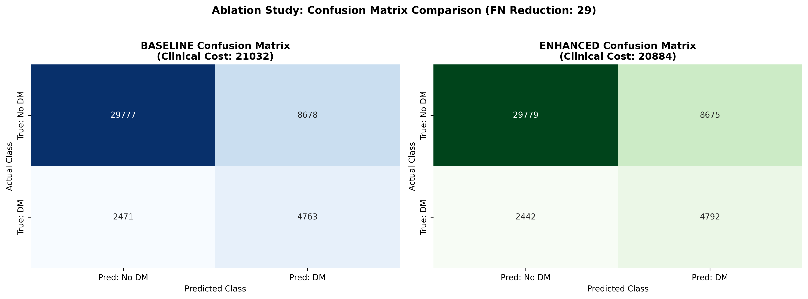
*Figure 14: Ablation confusion matrix comparison (baseline vs clustering-enhanced, clustering features contribute only +0.56% clinical score)*

- **Marginal Improvement**: Clustering features (Risk_Index/Cluster_ID) boost metrics:
  - Clinical Score: **+0.56%** (primary metric, from 0.5368→0.5398)
  - AUC-ROC: **+0.08%** (from 0.8005→0.8011, statistically significant p<0.001)
  - PR-AUC: **+0.61%** (from 0.4210→0.4236)
- **Cost-Benefit**: Clustering stage takes ~10 minutes, worth keeping in production?
- **Recommendation**: For resource-constrained scenarios, **baseline XGBoost model sufficient** (AUC=0.8005, default params)
  - **Note**: Hyperparameter optimization (OPTUNA) boosts AUC to **0.8191**, far exceeding clustering contribution

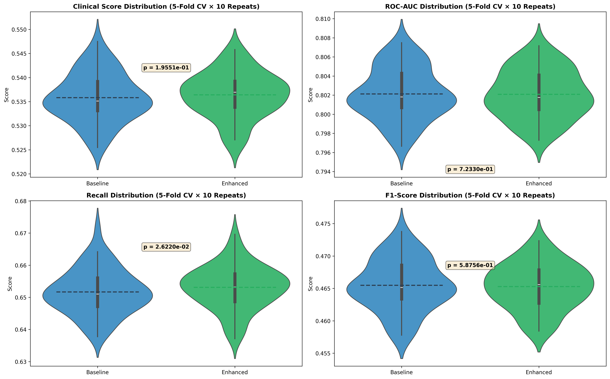
*Figure 15: 5-fold cross-validation ablation distributions (showing stable improvement from clustering enhancement)*

---

### 7. Implementation Recommendations

#### Pre-deployment Requirements
1. **Clinical Validation**: Validate prediction-outcome consistency in small-scale prospective studies
2. **Medical Ethics Review**: IRB (Institutional Review Board) approval
3. **HIPAA Compliance**: Ensure patient privacy protection
4. **Physician Training**: Educate clinicians on correct result interpretation

#### Continuous Monitoring Framework
- **Performance Degradation Monitoring**: Quarterly assess if AUC/Recall declines
- **Fairness Monitoring**: Evaluate performance disparities by race/sex/income
- **Feedback Loop**: Collect clinician feedback, iteratively optimize model

---

## 🚧 Future Roadmap

### Short-term Improvements

- [ ] **Temporal Extension**: Integrate 2016-2026 BRFSS data to track trend changes
- [ ] **Incremental Learning**: Implement online learning framework to adapt to new data
- [ ] **Feature Enhancement**: Incorporate genetic risk score (GRS) and dietary quality index
- [ ] **Model Ensemble**: Stacking fusion of XGBoost/LightGBM/CatBoost

### Medium-term Plans

- [ ] **Causal Inference**: Use instrumental variables to evaluate intervention effects
- [ ] **Survival Analysis**: Cox regression to predict diabetes onset time (time-to-event)
- [ ] **Multi-task Learning**: Simultaneously predict diabetes/cardiovascular disease/chronic kidney disease
- [ ] **Federated Learning**: Cross-institution collaborative modeling (privacy-preserving)

### Long-term Vision

- [ ] **Clinical Decision Support System (CDSS)**: Embed in electronic health records (EHR)
- [ ] **Mobile Health Application**: Personalized risk assessment and behavioral intervention APP
- [ ] **Policy Simulation**: Evaluate cost-effectiveness of different public health interventions
- [ ] **Global Health**: Multi-country dataset validation of model generalizability

---

<div align="center">

**DiaMetric-CDC: Diabetes Risk Prediction System**

Based on 2015 CDC BRFSS Data | Hybrid Modeling Paradigm | Clinical-Grade Interpretability

---

*This project demonstrates complete machine learning engineering practices from data understanding to production deployment*

[⬆ Back to Top](#diametric-cdc-intelligent-diabetes-risk-prediction-system-based-on-cdc-brfss-data)

</div>
